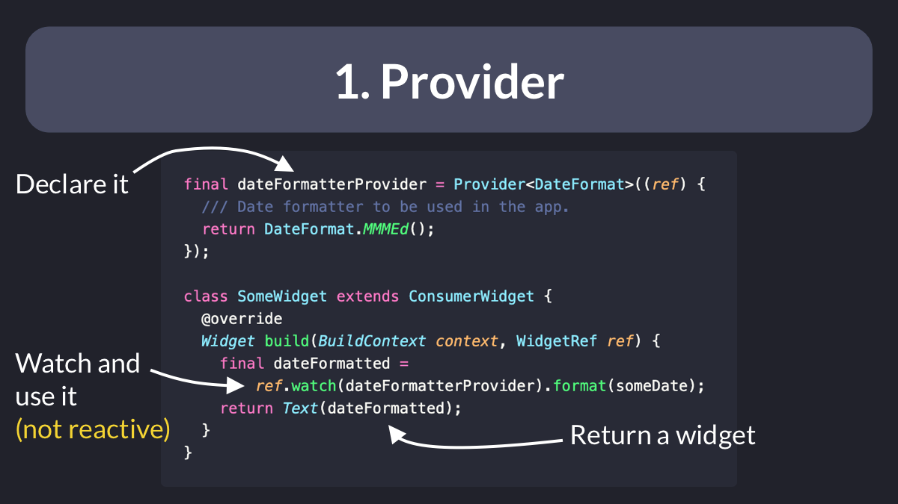
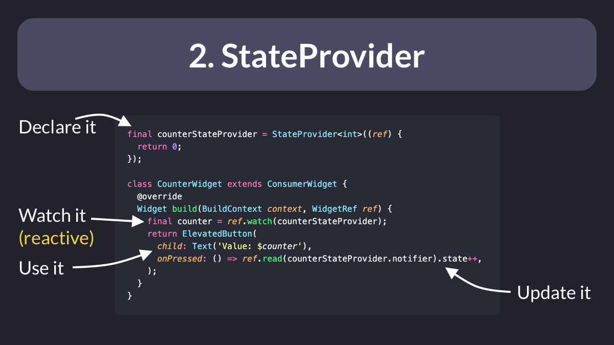
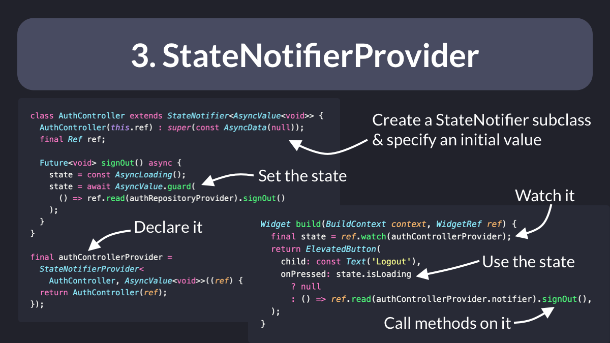
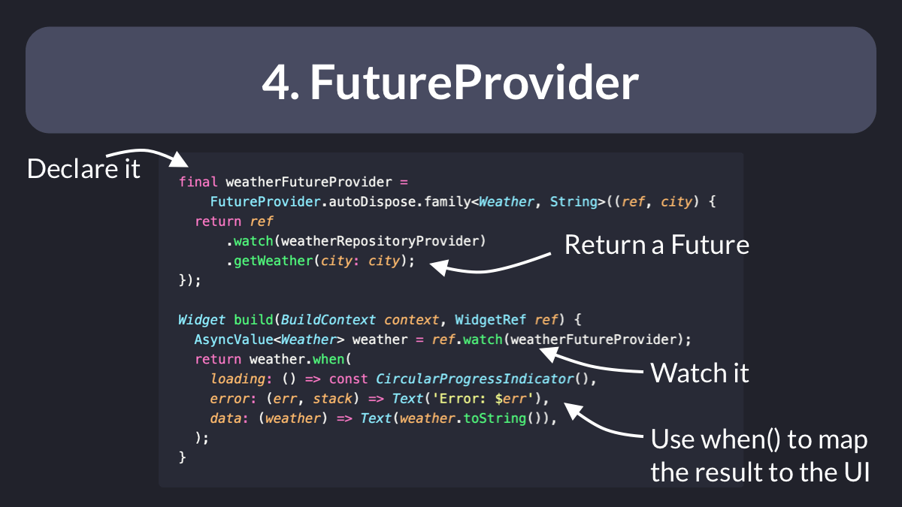
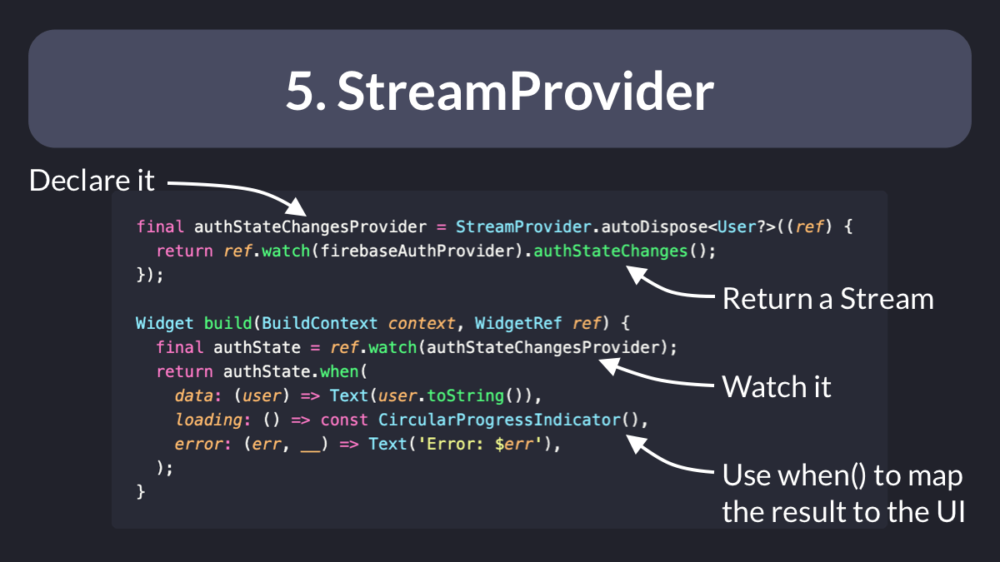
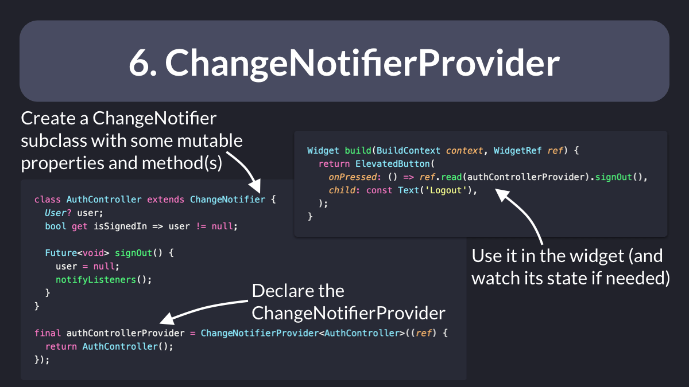

## Flutter Riverpod
[Riverpod](https://pub.dev/packages/riverpod) is a reactive caching and data-binding framework that was born as an evolution of the [Provider](https://pub.dev/packages/provider) package.

According to the [official documentation](https://pub.dev/packages/riverpod):
Riverpod is a complete rewrite of the Provider package to make improvements that would be otherwise impossible.

Riverpod offers 6 different kinds of providers, all suited for different use cases.

### 1. `Provider`

Great for accessing dependencies and objects that don’t change.
You may use this to access a repository, a logger, a date-time formatter, or a function that returns the current time.
Don't use this to hold data or state objects that should cause a widget rebuild.

### 2. `StateProvider`

Great for storing simple state objects that can change (such as a counter value).
You can read a `StateProvider` and update its state inside a button callback.
And you can watch it inside a widget so that it rebuilds when the state changes.

### 3. `StateNotifierProvider`

Use this to access a `StateNotifier` subclass that you have created.
Great for storing more complex widget state, along with the logic for updating it.
Don't use this if you only need to *read* some async data. That's what `FutureProvider` is for. 👇

### 4. `FutureProvider`

Want to get the result from an API call that returns a Future?
Then just create a `FutureProvider`, watch it in the build method, and map the resulting `AsyncValue` (data, loading, error) to your UI.
You can even refresh a `FutureProvider` to get updated data.

### 5. `StreamProvider`

Great for watching a `Stream` of results from an API and *reactively* rebuilding the UI.
Doesn't require an explicit refresh to get the updated data (it's realtime by design).
Use cases: auth state changes, realtime database updates, etc.

### 6. `ChangeNotifierProvider`

This is only useful for legacy applications and APIs that store mutable data inside `ChangeNotifier` subclasses.
Not recommended. For new projects, use `StateNotifierProvider` instead.

**Modifiers** is a function that is used to modify or enhance the behavior of a Provider. Modifiers are used to add additional functionality to Providers, such as caching, lazy initialization, or filtering. 
Here are some examples of modifiers in Riverpod: 
`.family`: This modifier is used to create a family of Providers that share similar behavior. For example, you could create a family of HTTP Clients that share the same base URL. 
`.autoDispose`: This modifier is used to automatically dispose of a Provider when it is no longer being used. This can be useful for Providers that consume resources, such as database connections. 
`.overrideWithValue`: This modifier is used to override the value of a Provider with a new value. This can be useful for testing or for providing mock data. 
`.state`: This modifier is used to create a Provider that manages a mutable state value. This can be useful for managing UI state, such as whether a button is disabled or enabled.

